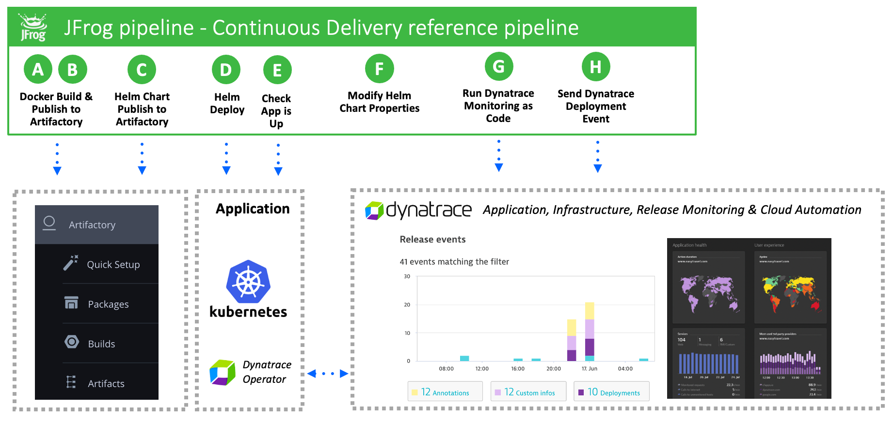

# Overview

The repo contains a reference JFrog pipeline that showcases how to integrate [Dynatrace](https://www.dynatrace.com) into [JFrog software delivery pipelines](https://www.jfrog.com) for Kubernetes. To learn how to setup and use this reference pipeline, see the a detailed guide on the [JFrog Wiki]().

# Repo structure

| File or Folder/ | Comment |
| ------ | ------- |
| pipeline.yml | JFrog pipeline file |
| setup/ | Bash scripts used one time as part of the setup process |
| scripts/ | Bash scripts called by the pipeline -- see [README](scripts/README.md)||
| chart/ | Helm charts used for sample application deployment |
| app/ | Sample application source code and Dockerfile -- see [README](app/README.md)|
| monaco/ | Dynatrace configuration files -- see [README](monaco/README.md) |
| images/ | README images |

# Support

If you have questions about this integration, please contact partner_support@JFrog.com
