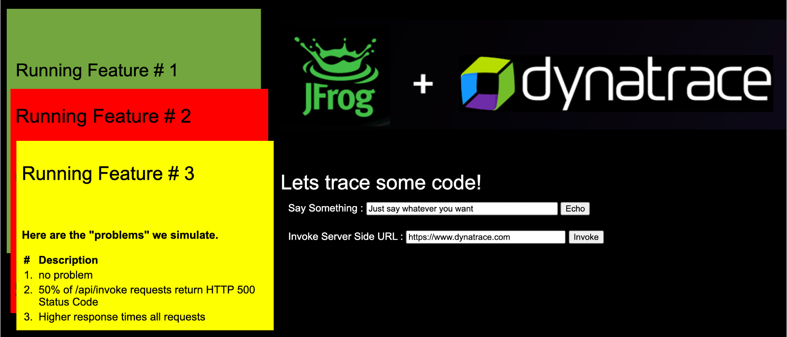

# Overview

Simple one page Node.JS app with built-in an option to slow down server-side code execution or to simulate failed requests.

The app also comes with 4 built-in "feature" behaviors - meaning - if you launch the app and tell it to run as Feature 1, 2, 3 to show slightly different behavior. 

| Feature | Behavior |
| ----- | --------- |
| 1 | Everything good |
| 2 | 50% Failure Rate of /api/invoke|
| 3 | Higher response times all requests|

As shown below, the web UI will change colors based on the enabled feature.



# Development

1. You must have node installed locally.
1. Once you clone the repo, you need to run npm install to download the required modules.  I used npm: '7.5.0',
  node: '15.8.0'
  
    ```
    npm update
    npm start
    ```

    Access the application @ http://127.0.0.1:8080/

1. Build and run Docker image manually

    ```
    docker build --build-arg FEATURE_NUMBER=1 -t dt-demos/jfrog-demo-app:1.0.0 .
    docker run -it -p 8080:8080 dt-demos/jfrog-demo-app:1.0.0
    ```
    
    Access the application @ http://127.0.0.1:8080/